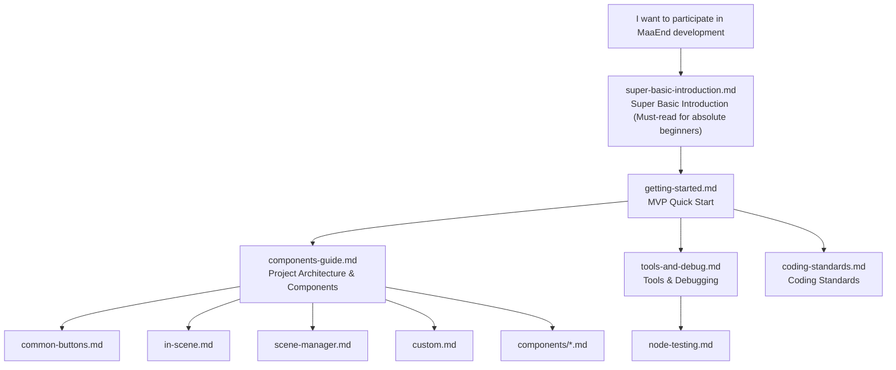

# MaaEnd Developer Documentation

This directory contains all the developer documentation for the MaaEnd project.

## Reading Route

It is recommended to read in the following order:

1.  If you are a complete beginner and feel lost when you see `git clone` or `pnpm install` → `super-basic-introduction.md`
2.  Set up the environment, get it running, and make a change → `getting-started.md`
3.  Understand the project architecture and reusable nodes → `components-guide.md`
4.  Master development tools and debugging workflow → `tools-and-debug.md`
5.  Consult coding standards → `coding-standards.md`
6.  When you need to write test sets → `node-testing.md`
7.  When using a specific advanced component → refer to the corresponding documentation under `components/`
8.  When maintaining a specific task → refer to the corresponding documentation under `tasks/`

> [!WARNING]
> **You must read the [Coding Standards](./coding-standards.md) before submitting any code.**
> PRs that do not comply with the standards will be rejected outright.

## Documentation Index

### Tier 1 — Quick Start

| Document                                                  | Description                                                                          |
| --------------------------------------------------------- | ------------------------------------------------------------------------------------ |
| [Super Basic Introduction](./super-basic-introduction.md) | For absolute beginners: what are Git, Terminal, VS Code, JSON, and how to use them   |
| [Getting Started](./getting-started.md)                   | Set up environment, run the program, make your first change and PR within 10 minutes |

### Tier 2 — Reference Manual

| Document                                                          | Description                                                                 |
| ----------------------------------------------------------------- | --------------------------------------------------------------------------- |
| [DeepWiki — MaaEnd](https://deepwiki.com/MaaEnd/MaaEnd)           | Online project documentation overview with AI                               |
| [Components Guide](./components-guide.md)                         | Project architecture, where to make changes, reusable node directory        |
| [Tools & Debugging](./tools-and-debug.md)                         | Development tools list, common debugging entry points, community group info |
| [Node Testing](./node-testing.md)                                 | How to write and run node tests to verify stable recognition hits           |
| [Pipeline Protocol](https://maafw.com/docs/3.1-PipelineProtocol/) | Full text of MaaFramework official Pipeline protocol                        |
| [Release Process](./release-process.md)                           | Release cycle, branch model, where to submit PRs, automation details        |

### Tier 3 — Standards & Constraints

| Document                                                  | Description                                                              |
| --------------------------------------------------------- | ------------------------------------------------------------------------ |
| [**Coding Standards (Must-read)**](./coding-standards.md) | Pipeline / Go / Cpp coding rules, pre-submission checks, common pitfalls |

### Pipeline Basic Components

The most commonly used reusable nodes in daily development. All Pipeline developers are advised to consult these during development for reuse.

| Document                                      | Description                                                                                           |
| --------------------------------------------- | ----------------------------------------------------------------------------------------------------- |
| [Common Buttons](./common-buttons.md)         | White/yellow confirm, cancel, close, teleport and other common button nodes                           |
| [InScene Recognition](./in-scene.md)          | Universal scene recognition, determines the current screen's scene                                    |
| [SceneManager Navigation](./scene-manager.md) | Universal navigation mechanism, automatically navigate/teleport from any interface to target scene/UI |
| [Custom Actions & Recognition](./custom.md)   | Common Custom nodes like SubTask, ClearHitCount, ExpressionRecognition, etc.                          |

### Advanced Component Reference (`components/`)

Consult as needed. Only required when using the corresponding component.

| Document                                                    | Description                                                                                    |
| ----------------------------------------------------------- | ---------------------------------------------------------------------------------------------- |
| [AutoFight](./components/auto-fight.md)                     | In-battle automation module, automatically performs normal attacks, skills, chain skills, etc. |
| [CharacterController](./components/character-controller.md) | Character view rotation, movement, and automatic movement towards target                       |
| [BetterSliding](./components/better-sliding.md)             | Common custom action for adjusting discrete quantity sliders by target value                   |
| [RecoGrid Engine](./components/recogrid-engine.md)          | C++ grid recognition, multi-template classification, and scroll accumulation scanning engine   |
| [MapLocator](./components/map-locator.md)                   | AI + CV based minimap positioning system, outputs region, coordinates, and orientation         |
| [MapTracker](./components/map-tracker.md)                   | Computer vision based minimap tracking and path movement                                       |
| [MapNavigator](./components/map-navigator.md)               | High-precision automatic navigation Action, with GUI recording tool                            |

### Task Maintenance Documents (`tasks/`)

Only required when maintaining the corresponding task.

| Document                                                            | Description                                                                                                            |
| ------------------------------------------------------------------- | ---------------------------------------------------------------------------------------------------------------------- |
| [AutoStockpile](./tasks/auto-stockpile-maintain.md)                 | Product templates, product mapping, price thresholds, and region extension maintenance                                 |
| [AutoStockStaple](./tasks/auto-stockstaple-maintain.md)             | Regular expression initialization, product recognition chain, quantity control                                         |
| [DijiangRewards](./tasks/dijiang-rewards-maintain.md)               | Main flow, stage responsibilities, and interface option override logic                                                 |
| [CreditShopping](./tasks/credit-shopping-maintain.md)               | Purchase priority, credit linkage, refresh strategy, and product extension                                             |
| [EnvironmentMonitoring](./tasks/environment-monitoring-maintain.md) | Observation point route data, `pipeline-generate` automatic generation and new point integration process               |
| [SellProduct](./tasks/sell-product-maintain.md)                     | zmdmap data generation, stronghold selling Pipeline, and priority item maintenance                                     |
| [GiftOperator](./tasks/gift-operator-maintain.md)                   | Navigation pathfinding, contact operator selection, gift giving/receiving branches, and operator extension maintenance |

### Third-Party Protocol Documents (`protocol/`)

Define the format specifications for files written by MaaEnd, for reliable reading by external tools (data analysis panels, web frontends, etc.).

| Document                                                                                | Description                                                            |
| --------------------------------------------------------------------------------------- | ---------------------------------------------------------------------- |
| [AutoStockpile Daily Price Record](../protocol/autostockpile-daily-storage/protocol.md) | `ElasticGoodsPrices.json` file format, path parsing, and writing rules |

## Quick Jump

| I want to...                                                | Where to look                                                                                                                                                   |
| ----------------------------------------------------------- | --------------------------------------------------------------------------------------------------------------------------------------------------------------- |
| I'm a complete beginner, I don't understand the terminology | [super-basic-introduction.md](./super-basic-introduction.md)                                                                                                    |
| Participate for the first time, starting from scratch       | [getting-started.md](./getting-started.md)                                                                                                                      |
| Understand the project architecture                         | [components-guide.md](./components-guide.md)                                                                                                                    |
| Modify Pipeline nodes                                       | [components-guide.md](./components-guide.md) → [common-buttons.md](./common-buttons.md) / [in-scene.md](./in-scene.md) / [scene-manager.md](./scene-manager.md) |
| Write or debug Go Service                                   | [components-guide.md](./components-guide.md) → [custom.md](./custom.md)                                                                                         |
| Consult coding standards                                    | [coding-standards.md](./coding-standards.md)                                                                                                                    |
| Release / Submit PR, which branch to target                 | [release-process.md](./release-process.md)                                                                                                                      |

## Communication

Development QQ Group: [1072587329](https://qm.qq.com/q/EyirQpBiW4) (A working group, welcome to join and develop together, but user issues are not handled here)

## AI Automatic Sync

- Corresponding GitHub Action is located at: `.github/workflows/docs-sync.yml`
- Purpose: When manually triggered, it first fixes a repository snapshot, then based on the Chinese source file hash recorded in `docs/en_us/.docs-sync-state.json`, identifies the `docs/zh_cn/**` documents needing sync in that snapshot, translates the corresponding content to `docs/en_us/**`, and finally the bot automatically creates a PR.
- Current mode: Only manual `workflow_dispatch`; automatic triggering has been commented out and disabled for now.
- Limitations: The LLM is only used as a per-file translator; diff collection, document link rewriting, file writing, permission scope validation for modifications, pushing branches, and creating PRs are all handled by scripts and workflows.
- Translation script: `tools/docs/translate_with_llm.py`
- Runtime dependency: A `DOCS_TRANSLATION_CONFIG` secret; `MAAEND_BOT_TOKEN` is optional; if not configured, uses the default `GITHUB_TOKEN` provided by GitHub Actions.
- `DOCS_TRANSLATION_CONFIG` contains translation endpoint configuration: `api_key`, `model`, `base_url`, optional `api_style` (`openai`, `anthropic`, or `gemini`), and `max_tokens`.
- Optional backend: When triggered manually, you can choose `translator=copilot`, which uses `COPILOT_GITHUB_TOKEN`; the default is `translator=config`, which does not use Copilot normally.
- `pr_branch` can only use the `chore/docs-auto-sync*` prefix and cannot be equal to the default branch name.
