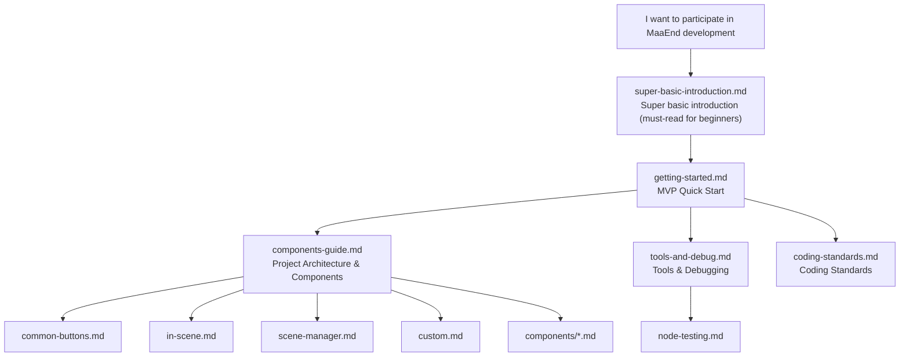

# MaaEnd Developer Documentation

This directory contains all developer documentation for the MaaEnd project.

## Reading Path

It is recommended to read in the following order:

1.  Completely zero-based, confused seeing `git clone`, `pnpm install` → `super-basic-introduction.md`
2.  Set up the environment, run it, make a change → `getting-started.md`
3.  Understand the project architecture and reusable nodes → `components-guide.md`
4.  Master development tools and debugging workflow → `tools-and-debug.md`
5.  Consult coding standards → `coding-standards.md`
6.  When you need to write a test suite → `node-testing.md`
7.  When using a specific advanced component → Check the corresponding document under `components/`
8.  When maintaining a specific task → Check the corresponding document under `tasks/`

> [!WARNING]
> **Before submitting any code, you must read the [Coding Standards](./coding-standards.md) first.**
> Non-compliant PRs will be rejected immediately.

## Documentation Index

### Tier 1 — Quick Start

| Document                                                  | Description                                                                         |
| --------------------------------------------------------- | ----------------------------------------------------------------------------------- |
| [Super Basic Introduction](./super-basic-introduction.md) | For complete beginners: What Git, terminal, VS Code, JSON are, and how to use them  |
| [Quick Start](./getting-started.md)                       | Set up environment, run the program, make the first change and PR within 10 minutes |

### Tier 2 — Reference Manual

| Document                                                          | Description                                                            |
| ----------------------------------------------------------------- | ---------------------------------------------------------------------- |
| [DeepWiki — MaaEnd](https://deepwiki.com/MaaEnd/MaaEnd)           | Online project documentation overview with AI                          |
| [Components Guide](./components-guide.md)                         | Project architecture, deciding what to change, reusable node directory |
| [Tools & Debugging](./tools-and-debug.md)                         | Development tools list, common debugging entry points, group chat info |
| [Node Testing](./node-testing.md)                                 | How to write and run node tests to verify stable recognition           |
| [Pipeline Protocol](https://maafw.com/docs/3.1-PipelineProtocol/) | Full text of the official MaaFramework Pipeline Protocol               |

### Tier 3 — Standards & Constraints

| Document                                                  | Description                                                              |
| --------------------------------------------------------- | ------------------------------------------------------------------------ |
| [**Coding Standards (Must Read)**](./coding-standards.md) | Pipeline / Go / Cpp coding rules, pre-submission checks, common pitfalls |

### Pipeline Basic Components

Commonly used reusable nodes in daily development. Recommended for all Pipeline developers to consult for reuse during development.

| Document                                    | Description                                                                                       |
| ------------------------------------------- | ------------------------------------------------------------------------------------------------- |
| [Common Buttons](./common-buttons.md)       | Common button nodes like white/yellow confirm, cancel, close, teleport                            |
| [InScene Recognition](./in-scene.md)        | Universal scene recognition, determines the current scene on screen                               |
| [SceneManager Jump](./scene-manager.md)     | Universal jump mechanism, automatically navigates/teleports to target scene/UI from any interface |
| [Custom Actions & Recognition](./custom.md) | Common Custom nodes like SubTask, ClearHitCount, ExpressionRecognition                            |

### Advanced Component Reference (`components/`)

Consult as needed. Only need to be read when using the corresponding component.

| Document                                                           | Description                                                                                      |
| ------------------------------------------------------------------ | ------------------------------------------------------------------------------------------------ |
| [AutoFight Automatic Battle](./components/auto-fight.md)           | In-battle auto-operation module, automatically handles normal attacks, skills, link skills, etc. |
| [CharacterController](./components/character-controller.md)        | Character view rotation, movement, and automatic movement towards the target                     |
| [BetterSliding Quantitative Slide](./components/better-sliding.md) | Common custom action for adjusting discrete quantity sliders based on target value               |
| [MapLocator Mini-Map Positioning](./components/map-locator.md)     | AI + CV-based mini-map positioning system, outputs region, coordinates, and orientation          |
| [MapTracker Mini-Map Tracking](./components/map-tracker.md)        | Computer vision-based mini-map tracking and path movement                                        |
| [MapNavigator Path Navigation](./components/map-navigator.md)      | High-precision automatic navigation Action, with a GUI recording tool                            |

### Task Maintenance Documentation (`tasks/`)

Only need to be read when maintaining the corresponding task.

| Document                                                            | Description                                                                                       |
| ------------------------------------------------------------------- | ------------------------------------------------------------------------------------------------- |
| [AutoStockpile](./tasks/auto-stockpile-maintain.md)                 | Product template, product mapping, price threshold & region extension maintenance                 |
| [AutoStockStaple](./tasks/auto-stockstaple-maintain.md)             | Regex initialization, product identification chain, quantity control                              |
| [DijiangRewards](./tasks/dijiang-rewards-maintain.md)               | Main process, stage responsibilities, and interface option override logic                         |
| [CreditShopping](./tasks/credit-shopping-maintain.md)               | Purchase priority, credit linkage, refresh strategy & product extension                           |
| [EnvironmentMonitoring](./tasks/environment-monitoring-maintain.md) | Observation point route data, `pipeline-generate` auto-generation & new point integration process |
| [SellProduct](./tasks/sell-product-maintain.md)                     | zmdmap data generation, stronghold selling Pipeline & priority item maintenance                   |
| [GiftOperator](./tasks/gift-operator-maintain.md)                   | Navigation, contact selection, give/receive branches, and operator extension maintenance          |

### Third-Party Protocol Documentation (`protocol/`)

Defines the format specifications for files written by MaaEnd, for reliable reading by external tools (data analysis dashboards, web frontends, etc.).

| Document                                                                                | Description                                                          |
| --------------------------------------------------------------------------------------- | -------------------------------------------------------------------- |
| [AutoStockpile Daily Price Record](../protocol/autostockpile-daily-storage/protocol.md) | `ElasticGoodsPrices.json` file format, path resolution & write rules |

## Quick Navigation

| I want to do what                          | Where to look                                                                                                                                                   |
| ------------------------------------------ | --------------------------------------------------------------------------------------------------------------------------------------------------------------- |
| Complete beginner, can't understand terms  | [super-basic-introduction.md](./super-basic-introduction.md)                                                                                                    |
| First participation, starting from scratch | [getting-started.md](./getting-started.md)                                                                                                                      |
| Understand project architecture            | [components-guide.md](./components-guide.md)                                                                                                                    |
| Modify Pipeline nodes                      | [components-guide.md](./components-guide.md) → [common-buttons.md](./common-buttons.md) / [in-scene.md](./in-scene.md) / [scene-manager.md](./scene-manager.md) |
| Write or debug Go Service                  | [components-guide.md](./components-guide.md) → [custom.md](./custom.md)                                                                                         |
| Consult coding standards                   | [coding-standards.md](./coding-standards.md)                                                                                                                    |

## Communication

Development QQ Group: [1072587329](https://qm.qq.com/q/EyirQpBiW4) (Work group, welcome to join and develop together, but does not handle user issues)

## AI Auto-Sync

- Corresponding GitHub Action located at: `.github/workflows/docs-sync.yml`
- Purpose: After manual trigger, first fix a repository snapshot, then find the `docs/zh_cn/**` documents needing sync in that snapshot based on the Chinese source file hash recorded in `docs/en_us/.docs-sync-state.json`, translate the corresponding content to `docs/en_us/**`, and finally have the bot automatically create a PR.
- Current mode: Manual `workflow_dispatch` only, automatic triggering has been commented out and disabled.
- Limitations: LLM is only used as a file-by-file translator; diff collection, document link rewriting, file writing, modification scope validation, pushing branches, and creating PRs are all handled by scripts and workflow.
- Translation script: `tools/docs/translate_with_llm.py`
- Runtime dependency: A `DOCS_TRANSLATION_CONFIG` secret; `MAAEND_BOT_TOKEN` is optional, uses the built-in `GITHUB_TOKEN` from GitHub Actions if not configured.
- `DOCS_TRANSLATION_CONFIG` contains translation endpoint configuration: `api_key`, `model`, `base_url`, optional `api_style` (`openai`, `anthropic`, or `gemini`) and `max_tokens`.
- Optional backend: When triggered manually, can choose `translator=copilot`, then uses `COPILOT_GITHUB_TOKEN`; defaults to `translator=config`, does not use Copilot normally.
- `pr_branch` can only use the `chore/docs-auto-sync*` prefix and cannot equal the default branch name.
