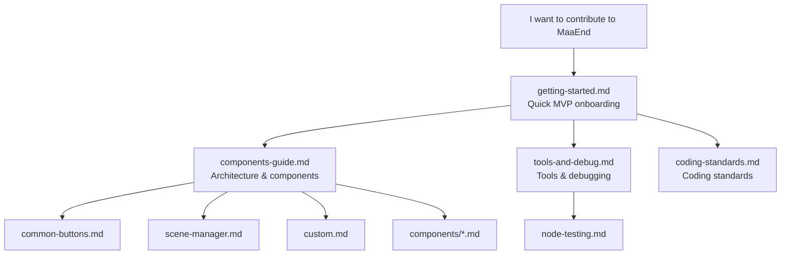

# MaaEnd Developer Documentation

This directory contains all developer documentation for the MaaEnd project.

## Reading path

Suggested reading order:

1. Set up the environment, run something, change one thing → `getting-started.md`
2. Understand project architecture and reusable nodes → `components-guide.md`
3. Master dev tools and debugging → `tools-and-debug.md`
4. Coding standards → `coding-standards.md`
5. When you need test sets → `node-testing.md`
6. When using an advanced component → see the matching doc under `components/`
7. When maintaining a specific task → see the matching doc under `tasks/`

## Document index

### Tier 1 — Quick start

| Document                                | Description                                                                    |
| --------------------------------------- | ------------------------------------------------------------------------------ |
| [Getting started](./getting-started.md) | Set up the environment, run the app, and ship a first change/PR in ~10 minutes |

### Tier 2 — Reference

| Document                                                          | Description                                                     |
| ----------------------------------------------------------------- | --------------------------------------------------------------- |
| [DeepWiki — MaaEnd](https://deepwiki.com/MaaEnd/MaaEnd)           | AI-assisted online project overview                             |
| [Components guide](./components-guide.md)                         | Architecture, where to change what, catalog of reusable nodes   |
| [Tools & debugging](./tools-and-debug.md)                         | Dev tools, debugging workflow, resource rules, OCR & i18n       |
| [Node testing](./node-testing.md)                                 | How to write and run node tests; verify stable recognition hits |
| [Pipeline protocol](https://maafw.com/docs/3.1-PipelineProtocol/) | Official MaaFramework Pipeline protocol (full spec)             |

### Tier 3 — Standards & constraints

| Document                                  | Description                                                   |
| ----------------------------------------- | ------------------------------------------------------------- |
| [Coding standards](./coding-standards.md) | Pipeline / Go / Cpp rules, pre-submit checks, common pitfalls |

### Pipeline building blocks

Reusable nodes used most often in daily development—Pipeline authors should skim these before writing new logic.

| Document                                    | Description                                                                  |
| ------------------------------------------- | ---------------------------------------------------------------------------- |
| [Common buttons](./common-buttons.md)       | White/yellow confirm, cancel, close, teleport, etc.                          |
| [SceneManager](./scene-manager.md)          | Universal navigation from any screen to a target scene/UI                    |
| [Custom actions & recognition](./custom.md) | SubTask, ClearHitCount, ExpressionRecognition, and other shared Custom nodes |

### Advanced components (`components/`)

Read on demand—only when you use the corresponding feature.

| Document                                                    | Description                                             |
| ----------------------------------------------------------- | ------------------------------------------------------- |
| [AutoFight](./components/auto-fight.md)                     | In-combat automation: basics, skills, chain attacks     |
| [CharacterController](./components/character-controller.md) | Camera, movement, and move-to-target                    |
| [BetterSliding](./components/better-sliding.md)             | Custom action for discrete quantity sliders             |
| [MapLocator](./components/map-locator.md)                   | AI + CV minimap localization (region, position, facing) |
| [MapTracker](./components/map-tracker.md)                   | CV-based minimap tracking and path movement             |
| [MapNavigator](./components/map-navigator.md)               | High-precision navigation action + GUI recording tool   |

### Task maintenance docs (`tasks/`)

Only when you maintain the matching task.

| Document                                                            | Description                                                                                  |
| ------------------------------------------------------------------- | -------------------------------------------------------------------------------------------- |
| [AutoStockpile](./tasks/auto-stockpile-maintain.md)                 | Item templates, mapping, price thresholds, region extensions                                 |
| [DijiangRewards](./tasks/dijiang-rewards-maintain.md)               | Main flow, stage roles, interface option overrides                                           |
| [CreditShopping](./tasks/credit-shopping-maintain.md)               | Purchase priority, credit top-up linkage, refresh strategy, item extensions                  |
| [EnvironmentMonitoring](./tasks/environment-monitoring-maintain.md) | Observation-point route data, `pipeline-generate` auto-generation, and onboarding new points |

## Quick lookup

| I want to…                | Read this                                                                                                                        |
| ------------------------- | -------------------------------------------------------------------------------------------------------------------------------- |
| Start from zero           | [getting-started.md](./getting-started.md)                                                                                       |
| Understand architecture   | [components-guide.md](./components-guide.md)                                                                                     |
| Change Pipeline nodes     | [components-guide.md](./components-guide.md) → [common-buttons.md](./common-buttons.md) / [scene-manager.md](./scene-manager.md) |
| Write or debug Go Service | [components-guide.md](./components-guide.md) → [custom.md](./custom.md)                                                          |
| Coding standards          | [coding-standards.md](./coding-standards.md)                                                                                     |

## Community

Dev QQ group: [1072587329](https://qm.qq.com/q/EyirQpBiW4) (contributors welcome; **not** for end-user support)
