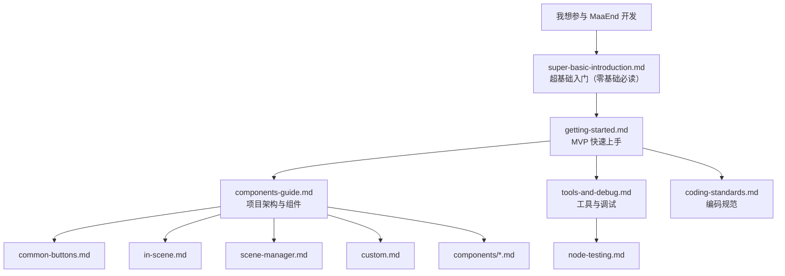

# MaaEnd 开发者文档

本目录包含 MaaEnd 项目的全部开发者文档。

## 阅读路线

建议按以下顺序阅读：

1. 完全零基础，看到 `git clone`、`pnpm install` 就懵了 → `super-basic-introduction.md`
2. 搭环境、跑起来、改一个东西 → `getting-started.md`
3. 了解项目架构和可复用节点 → `components-guide.md`
4. 掌握开发工具和调试流程 → `tools-and-debug.md`
5. 查阅编码规范 → `coding-standards.md`
6. 需要写测试集时 → `node-testing.md`
7. 用到某个高级组件时 → 查 `components/` 下的对应文档
8. 维护某个具体任务时 → 查 `tasks/` 下的对应文档

> [!WARNING]
> **提交任何代码前，必须先通读 [编码规范](./coding-standards.md)。**
> 不合规范的 PR 会被直接打回。

## 文档索引

### Tier 1 — 快速上手

| 文档                                        | 说明                                                  |
| ------------------------------------------- | ----------------------------------------------------- |
| [超基础入门](./super-basic-introduction.md) | 给完全零基础：Git、终端、VS Code、JSON 是什么，怎么用 |
| [快速开始](./getting-started.md)            | 10 分钟内搭环境、跑程序、完成第一次改动和PR           |

### Tier 2 — 参考手册

| 文档                                                          | 说明                                         |
| ------------------------------------------------------------- | -------------------------------------------- |
| [DeepWiki — MaaEnd](https://deepwiki.com/MaaEnd/MaaEnd)       | 带 AI 的在线项目文档速览                     |
| [组件指南](./components-guide.md)                             | 项目架构、判断改哪、可复用节点目录           |
| [工具与调试](./tools-and-debug.md)                            | 开发工具清单、常用调试入口、交流群信息       |
| [节点测试](./node-testing.md)                                 | 如何编写和运行节点测试，验证识别是否稳定命中 |
| [Pipeline 协议](https://maafw.com/docs/3.1-PipelineProtocol/) | MaaFramework 官方 Pipeline 协议全文          |

### Tier 3 — 规范与约束

| 文档                                          | 说明                                             |
| --------------------------------------------- | ------------------------------------------------ |
| [**编码规范（必看）**](./coding-standards.md) | Pipeline / Go / Cpp 编码规则、提交前检查、常见坑 |

### Pipeline 基础组件

日常开发最常用的可复用节点，建议所有 Pipeline 开发者开发时查询以便复用。

| 文档                                        | 说明                                                             |
| ------------------------------------------- | ---------------------------------------------------------------- |
| [通用按钮](./common-buttons.md)             | 白色/黄色确认、取消、关闭、传送等通用按钮节点                    |
| [InScene 场景识别](./in-scene.md)           | 万能场景识别，判断当前画面所在场景                               |
| [SceneManager 场景跳转](./scene-manager.md) | 万能跳转机制，从任意界面自动导航/传送到目标场景/UI               |
| [Custom 动作与识别](./custom.md)            | SubTask、ClearHitCount、ExpressionRecognition 等公共 Custom 节点 |

### 高级组件参考（`components/`）

按需查阅。仅在使用对应组件时需要阅读。

| 文档                                                                 | 说明                                                |
| -------------------------------------------------------------------- | --------------------------------------------------- |
| [AutoFight 自动战斗](./components/auto-fight.md)                     | 战斗内自动操作模块，自动完成普攻、技能、连携技等    |
| [CharacterController 角色控制](./components/character-controller.md) | 角色视角旋转、移动及朝向目标自动移动                |
| [BetterSliding 定量滑动](./components/better-sliding.md)             | 按目标值调节离散数量滑条的公共自定义动作            |
| [RecoGrid Engine 网格扫描](./components/recogrid-engine.md)          | C++ 网格识别、多模板分类与滚动累计扫描引擎          |
| [MapLocator 小地图定位](./components/map-locator.md)                 | 基于 AI + CV 的小地图定位系统，输出区域、坐标与朝向 |
| [MapTracker 小地图追踪](./components/map-tracker.md)                 | 基于计算机视觉的小地图追踪与路径移动                |
| [MapNavigator 路径导航](./components/map-navigator.md)               | 高精度自动导航 Action，附带 GUI 录制工具            |

### 任务维护文档（`tasks/`）

仅在维护对应任务时需要阅读。

| 文档                                                                         | 说明                                                       |
| ---------------------------------------------------------------------------- | ---------------------------------------------------------- |
| [AutoStockpile 自动囤货](./tasks/auto-stockpile-maintain.md)                 | 商品模板、商品映射、价格阈值与地区扩展维护                 |
| [AutoStockStaple 稳定需求物资](./tasks/auto-stockstaple-maintain.md)         | 正则初始化、商品识别链、数量控制                           |
| [DijiangRewards 基建任务](./tasks/dijiang-rewards-maintain.md)               | 主流程、阶段职责与 interface 选项覆盖逻辑                  |
| [CreditShopping 信用点商店](./tasks/credit-shopping-maintain.md)             | 购买优先级、补信用联动、刷新策略与商品扩展                 |
| [EnvironmentMonitoring 环境监测](./tasks/environment-monitoring-maintain.md) | 观察点路线数据、`pipeline-generate` 自动生成与新点接入流程 |
| [SellProduct 售卖产品](./tasks/sell-product-maintain.md)                     | zmdmap 数据生成、据点售卖 Pipeline 与优先物品维护          |
| [GiftOperator 赠送干员礼物](./tasks/gift-operator-maintain.md)               | 导航寻路、联络选人、送礼收礼分支与干员扩展维护             |

### 第三方协议文档（`protocol/`）

定义 MaaEnd 写入文件的格式规范，供外部工具（数据分析面板、Web 前端等）可靠读取。

| 文档                                                                              | 说明                                                   |
| --------------------------------------------------------------------------------- | ------------------------------------------------------ |
| [AutoStockpile 每日价格记录](../protocol/autostockpile-daily-storage/protocol.md) | `ElasticGoodsPrices.json` 文件格式、路径解析与写入规则 |

## 快速跳转

| 我想做什么               | 该看哪里                                                                                                                                                        |
| ------------------------ | --------------------------------------------------------------------------------------------------------------------------------------------------------------- |
| 完全零基础，术语都看不懂 | [super-basic-introduction.md](./super-basic-introduction.md)                                                                                                    |
| 第一次参与，从零开始     | [getting-started.md](./getting-started.md)                                                                                                                      |
| 了解项目架构             | [components-guide.md](./components-guide.md)                                                                                                                    |
| 改 Pipeline 节点         | [components-guide.md](./components-guide.md) → [common-buttons.md](./common-buttons.md) / [in-scene.md](./in-scene.md) / [scene-manager.md](./scene-manager.md) |
| 写或调 Go Service        | [components-guide.md](./components-guide.md) → [custom.md](./custom.md)                                                                                         |
| 查阅编码规范             | [coding-standards.md](./coding-standards.md)                                                                                                                    |

## 交流

开发 QQ 群: [1072587329](https://qm.qq.com/q/EyirQpBiW4) （干活群，欢迎加入一起开发，但不受理用户问题）

## AI 自动同步

- 对应 GitHub Action 位于：`.github/workflows/docs-sync.yml`
- 用途：手动触发后，先固定一个仓库快照，再根据 `docs/en_us/.docs-sync-state.json` 记录的中文源文件 hash，找出该快照里需要同步的 `docs/zh_cn/**` 文档，并把对应内容翻译到 `docs/en_us/**`，最后由 bot 自动创建 PR
- 当前模式：仅手动 `workflow_dispatch`，自动触发已先注释停用
- 限制：LLM 只作为逐文件翻译器；diff 收集、文档链接重写、文件写入、允许修改范围校验、推分支和建 PR 都由脚本与 workflow 处理
- 翻译脚本：`tools/docs/translate_with_llm.py`
- 运行依赖：一个 `DOCS_TRANSLATION_CONFIG` secret；`MAAEND_BOT_TOKEN` 可选，未配置时使用 GitHub Actions 自带的 `GITHUB_TOKEN`
- `DOCS_TRANSLATION_CONFIG` 包含翻译端点配置：`api_key`、`model`、`base_url`、可选 `api_style`（`openai`、`anthropic` 或 `gemini`）和 `max_tokens`
- 可选后端：手动触发时可选择 `translator=copilot`，此时使用 `COPILOT_GITHUB_TOKEN`；默认 `translator=config`，平时不使用 Copilot
- `pr_branch` 只能使用 `chore/docs-auto-sync*` 前缀，且不能等于默认分支名
