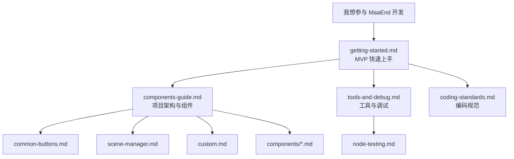

# MaaEnd 开发者文档

本目录包含 MaaEnd 项目的全部开发者文档。

## 阅读路线

建议按以下顺序阅读：

1. 搭环境、跑起来、改一个东西 → `getting-started.md`
2. 了解项目架构和可复用节点 → `components-guide.md`
3. 掌握开发工具和调试流程 → `tools-and-debug.md`
4. 查阅编码规范 → `coding-standards.md`
5. 需要写测试集时 → `node-testing.md`
6. 用到某个高级组件时 → 查 `components/` 下的对应文档
7. 维护某个具体任务时 → 查 `tasks/` 下的对应文档

## 文档索引

### Tier 1 — 快速上手

| 文档                             | 说明                                        |
| -------------------------------- | ------------------------------------------- |
| [快速开始](./getting-started.md) | 10 分钟内搭环境、跑程序、完成第一次改动和PR |

### Tier 2 — 参考手册

| 文档                                                          | 说明                                         |
| ------------------------------------------------------------- | -------------------------------------------- |
| [DeepWiki — MaaEnd](https://deepwiki.com/MaaEnd/MaaEnd)       | 带 AI 的在线项目文档速览                     |
| [组件指南](./components-guide.md)                             | 项目架构、判断改哪、可复用节点目录           |
| [工具与调试](./tools-and-debug.md)                            | 开发工具清单、常用调试入口、交流群信息       |
| [节点测试](./node-testing.md)                                 | 如何编写和运行节点测试，验证识别是否稳定命中 |
| [Pipeline 协议](https://maafw.com/docs/3.1-PipelineProtocol/) | MaaFramework 官方 Pipeline 协议全文          |

### Tier 3 — 规范与约束

| 文档                              | 说明                                             |
| --------------------------------- | ------------------------------------------------ |
| [编码规范](./coding-standards.md) | Pipeline / Go / Cpp 编码规则、提交前检查、常见坑 |

### Pipeline 基础组件

日常开发最常用的可复用节点，建议所有 Pipeline 开发者开发时查询以便复用。

| 文档                                        | 说明                                                             |
| ------------------------------------------- | ---------------------------------------------------------------- |
| [通用按钮](./common-buttons.md)             | 白色/黄色确认、取消、关闭、传送等通用按钮节点                    |
| [SceneManager 场景跳转](./scene-manager.md) | 万能跳转机制，从任意界面自动导航/传送到目标场景/UI               |
| [Custom 动作与识别](./custom.md)            | SubTask、ClearHitCount、ExpressionRecognition 等公共 Custom 节点 |

### 高级组件参考（`components/`）

按需查阅。仅在使用对应组件时需要阅读。

| 文档                                                                 | 说明                                                |
| -------------------------------------------------------------------- | --------------------------------------------------- |
| [AutoFight 自动战斗](./components/auto-fight.md)                     | 战斗内自动操作模块，自动完成普攻、技能、连携技等    |
| [CharacterController 角色控制](./components/character-controller.md) | 角色视角旋转、移动及朝向目标自动移动                |
| [BetterSliding 定量滑动](./components/better-sliding.md)             | 按目标值调节离散数量滑条的公共自定义动作            |
| [MapLocator 小地图定位](./components/map-locator.md)                 | 基于 AI + CV 的小地图定位系统，输出区域、坐标与朝向 |
| [MapTracker 小地图追踪](./components/map-tracker.md)                 | 基于计算机视觉的小地图追踪与路径移动                |
| [MapNavigator 路径导航](./components/map-navigator.md)               | 高精度自动导航 Action，附带 GUI 录制工具            |

### 任务维护文档（`tasks/`）

仅在维护对应任务时需要阅读。

| 文档                                                                         | 说明                                                       |
| ---------------------------------------------------------------------------- | ---------------------------------------------------------- |
| [AutoStockpile 自动囤货](./tasks/auto-stockpile-maintain.md)                 | 商品模板、商品映射、价格阈值与地区扩展维护                 |
| [DijiangRewards 基建任务](./tasks/dijiang-rewards-maintain.md)               | 主流程、阶段职责与 interface 选项覆盖逻辑                  |
| [CreditShopping 信用点商店](./tasks/credit-shopping-maintain.md)             | 购买优先级、补信用联动、刷新策略与商品扩展                 |
| [EnvironmentMonitoring 环境监测](./tasks/environment-monitoring-maintain.md) | 观察点路线数据、`pipeline-generate` 自动生成与新点接入流程 |

## 快速跳转

| 我想做什么           | 该看哪里                                                                                                                         |
| -------------------- | -------------------------------------------------------------------------------------------------------------------------------- |
| 第一次参与，从零开始 | [getting-started.md](./getting-started.md)                                                                                       |
| 了解项目架构         | [components-guide.md](./components-guide.md)                                                                                     |
| 改 Pipeline 节点     | [components-guide.md](./components-guide.md) → [common-buttons.md](./common-buttons.md) / [scene-manager.md](./scene-manager.md) |
| 写或调 Go Service    | [components-guide.md](./components-guide.md) → [custom.md](./custom.md)                                                          |
| 查阅编码规范         | [coding-standards.md](./coding-standards.md)                                                                                     |

## 交流

开发 QQ 群: [1072587329](https://qm.qq.com/q/EyirQpBiW4) （干活群，欢迎加入一起开发，但不受理用户问题）
